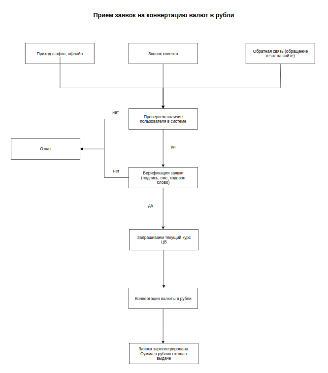

## Rest API
### Сервис приема заявок на конвертацию валют в рубли
____

#### О проекте:
Сервис предоставляет возможность в режиме онлайн пересчитать нужную сумму из одной 
валюты в рубли, например евро, доллар, британский фунт в рубли. Все расчеты 
конвертер выполняет на основе официальных данных о котировках международных валют 
ЦБ РФ.


Доступные валюты для конвертации:

- USD
- EUR
- GBP
- CHF

---

#### Схема взаимодействия



---

#### Technologies
- Java 16
- Spring Boot
- Hibernate
- Maven
- Postgres
- Docker


----

**Реализованный функционал:**
- Создание компонента для запроса в ЦБ
- XML парсер валют
- CRUD для обращений в сервис
- Получение пользователя по предоставленным данным
- Паттерны проектирования (Builder, Factory method)
- Полиморфизм для сущностей обращения
- DTO для запроса и ответа клиенту
- Enum классы для полей сущностей
- Связь один ко многим
- Mapper для преобразования сущности в DTO
- Criteria API для запросов
- Сервис для приема заявок
- Покрытие модульными тестами основного функционала

----

#### Использованные подходы к написанию кода:

- Чистый код
- ООП
- GRASP, SOLID
- DDD
- TDD

----


#### Запуск проекта

1. Переходим в папку `cd docker`
2. Выполняем команду make файла `make init`
3. Установим файлы проекта сборщиком `mvn install`
4. Запускаем Application

----
#### Примеры запроса

1. Получение всех обращений GET
`http://localhost:8080/api/appeals`


**Ответ:**
```json
{
  "id": 1,
  "type": "feedback",
  "sum": 1000,
  "currency": "EUR",
  "rate": 85.14,
  "output_sum": 85140.0,
  "is_verified_code_word": true,
  "account_id": 424,
  "created_at": "06-09-2021"
},
{
  "id": 2,
  "type": "call",
  "sum": 500,
  "currency": "CHF",
  "rate": 78.14,
  "output_sum": 39070.0,
  "created_at": "06-09-2021",
  "is_verified_sms_confirmation": true,
  "caller_phone_number": "+7988646545"
}
```

2. Добавление обращения POST `http://localhost:8080/api/appeals/register`

**Body**
```json
Заявка через офис
{
  "type": "offline",
  "sum": 45000,
  "currency": "USD",
  "offline_data": {
    "is_verified_document_provided": true,
    "number_document": 414
  }
}

Заявка через обратную связь
{
  "type": "feedback",
  "sum": 558,
  "currency": "CHF",
  "feedback_data": {
    "is_verified_code_word": true,
    "account_id": 2
  }
}

Заявка через звонок
{
  "type": "call",
  "sum": 50,
  "currency": "USD",
  "call_data": {
    "is_verified_sms_confirmation": true,
    "caller_phone_number": "+79888877777"
  }
}
```

**Ответ**
```json
{
  "id": 3,
  "type": "offline",
  "sum": 45000,
  "currency": "USD",
  "rate": 73.129,
  "output_sum": 3290805.0,
  "is_verified_document_provided": true,
  "number_document": 414,
  "created_at": "10-09-2021"
}
```

3. Обновление данных обращения PUT `http://localhost:8080/api/appeals/2`

**Body**
```json
{
  "sum": 40,
  "call_data": {
    "is_verified_sms_confirmation": false
  }
}
```

**Ответ**
```json
{
    "id": 2,
    "type": "call",
    "sum": 40,
    "currency": "USD",
    "rate": 44.11,
    "output_sum": 1764.4,
    "is_verified_sms_confirmation": false,
    "caller_phone_number": "+79888877777",
    "created_at": "06-09-2021"
}
```